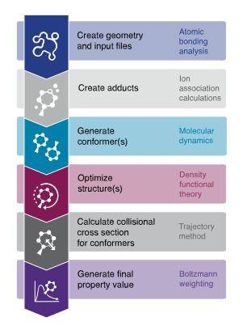

======
ISiCLE
======

ISiCLE, or the *in silico* chemical library engine, is a software framework for high-accuracy chemical property calculation.
ISiCLE takes an `InChI <https://en.wikipedia.org/wiki/International_Chemical_Identifier>`_ or `SMILES <https://en.wikipedia.org/wiki/Simplified_molecular-input_line-entry_system>`_ string as input, generates an initial 3D conformation, and subsequently optimizes this initial structure through molecular dynamics simulations and quantum chemistry optimizations.
Finally, ISiCLE simulates desired properties (e.g. collision cross section, nuclear magnetic resonance chemical shifts) for each conformer yielded during molecular dynamics simulations to produce a single value, Boltzmann-weighted by relative Gibb's free energy, giving emphasis to properties from highly probable conformations.

.. toctree::
	:caption: Getting started
	:name: getting_started
	:hidden:
	:maxdepth: 1

	getting_started/installation

.. toctree::
	:caption: User guide
	:name: user_guide
	:hidden:
	:maxdepth: 1

	user_guide/loading_saving
	user_guide/molecule_prep
	user_guide/conformer_generation
	user_guide/structure_optimization
	user_guide/property_prediction
	user_guide/CCS.ipynb
        user_guide/NMR.ipynb

.. toctree::
	:caption: API reference
	:name: api_reference
	:hidden:
	:maxdepth: 1

	api_reference/isicle
	api_reference/adducts
	api_reference/conformers
	api_reference/geometry
	api_reference/interfaces
	api_reference/io
	api_reference/md
	api_reference/mobility
	api_reference/parse
	api_reference/qm
	api_reference/utils

.. toctree::
	:caption: Project info
	:name: project_info
	:hidden:
	:maxdepth: 1

	project_info/acknowledgements
	project_info/citing_and_citations
	project_info/contributing
	project_info/license
	project_info/disclaimer

